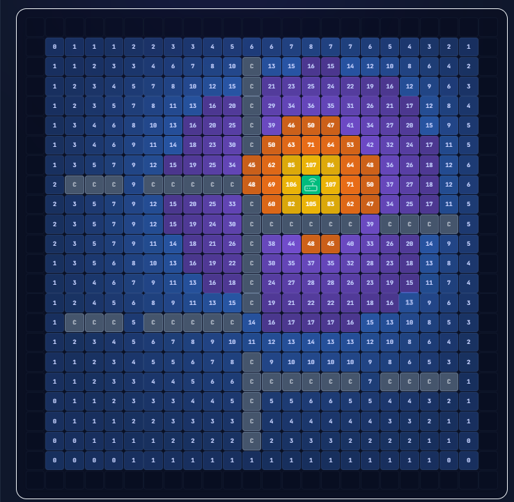
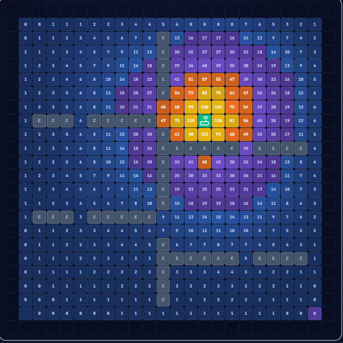
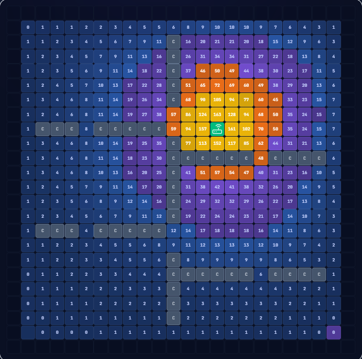
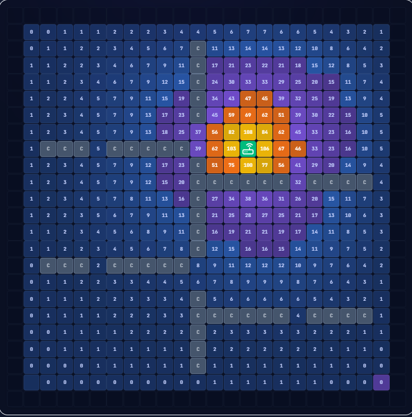

# INFORME FINAL

## MARCO TEÓRICO 

### Introducción

El presente marco teórico tiene como propósito fundamentar teórica y matemáticamente el método numérico seleccionado para el proyecto SimuNet WiFi.

El método de Sobre-Relajación Sucesiva, conocido por sus siglas en inglés como SOR (Successive Over-Relaxation) fue seleccionado por su eficiencia demostrada en la resolución óptima de sistemas de ecuaciones lineales grandes que surgen cuando se modela numéricamente el cómo se distribuye una magnitud física (como la temperatura, la presión o para este aplicativo la intensidad de señal WiFi) a lo largo de un espacio.

SimuNet WiFi es un simulador de cobertura de señal WiFi en espacios bidimensionales que modela la propagación electromagnética resolviendo la ecuación de Laplace sobre una malla regular de puntos distribuidos uniformemente sobre el plano simulado, donde cada punto almacena el valor de señal calculado en esa posición. La naturaleza del problema hace que el método SOR sea la elección teóricamente óptima dentro de la familia de métodos iterativos de resolución de sistemas lineales.

Pero, para comprender completamente el método SOR, es necesario primero establecer el contexto general de los métodos iterativos y presentar brevemente sus predecesores directos: el método de Jacobi y el método de Gauss-Seidel. Esta progresión natural permite identificar el problema que SOR resuelve y justificar por qué representa una mejora significativa sobre sus antecesores.

### Sistemas Lineales Iterativos

El problema central que busca resolver SimuNet WiFi es la resolución de un sistema de ecuaciones lineales de la forma: 

$$ Ax = b $$

Donde $A$ es la matriz del sistema, $x$ es el vector de incógnitas (valores de señal en cada nodo de la grilla) y $b$ es el vector de términos independientes (siendo estos los valores conocidos que se imponen en los bordes y en las posiciones del router).

Para una grilla de $24 \times 24$ nodos, da como resultado un sistema de 576 ecuaciones. Para una grilla de $32 \times 32$, el sistema crece a 1024 ecuaciones. Resolver sistemas de este tamaño con métodos directos implica una complejidad computacional de $O(n^3)$, lo que se vuelve "pesado" o no óptimo para la resolución de este tipo de aplicaciones.

### Métodos Predecesores del SOR

El método SOR no surgió directamente para solucionar este tipo de sistemas de ecuaciones, es una progresión que viene con 2 métodos anteriores.

Empezando con el **método de Jacobi**, siendo el primer algoritmo iterativo de relajación que resuelve el sistema de ecuaciones planteado, su principio fundamental es actualizar simultáneamente todos los valores de la solución usando exclusivamente los valores de la iteración anterior.

Siendo su fórmula:

$$ X_i^{(k+1)} = \frac{1}{a_{ii}} \left( b_i - \sum_{j \neq i} a_{ij} X_j^{(k)} \right) $$

Para el aplicativo, la principal limitación de Jacobi es que ignora información ya disponible, es decir, al actualizar la celda $(i,j)$, los valores de las celdas ya actualizadas en la misma iteración no se usan. Esto hace que la información se propague lentamente por la grilla, requiriendo muchas iteraciones para alcanzar la convergencia.

**Gauss-Seidel** es una mejora notoria del método Jacobi, ya que este sí utiliza los valores más recientes disponibles durante la misma iteración, eso se ve reflejado en su fórmula:

$$ X_i^{(k+1)} = \frac{1}{a_{ii}} \left( b_i - \sum_{j < i} a_{ij} X_j^{(k+1)} - \sum_{j > i} a_{ij} X_j^{(k)} \right) $$

Esta nueva "mecánica" aunque quizás sutil, es muy significativa puesto que la información se propaga por la grilla aproximadamente el doble de rápido que con Jacobi. Para matrices simétricas definidas positivas (como la que proviene de la discretización de Laplace) se puede demostrar que Gauss-Seidel converge siempre que Jacobi converge, y lo hace en aproximadamente la mitad de iteraciones.

No obstante, Gauss-Seidel tiene un límite natural de aceleración, pudiendo sólo usar la información que obtiene en el orden en que recorre la grilla, sin ningún mecanismo para "anticipar" cuánto debe corregir cada nodo. Es precisamente este problema el que SOR resuelve.

### Y ahí es donde entra el método SOR

El método SOR fue introducido formalmente por David M. Young Jr. en 1950 en su tesis doctoral en la Universidad de Harvard, y representa una de las contribuciones más importantes al análisis numérico del siglo XX. La idea central es proyectar la corrección que realiza Gauss-Seidel mediante un factor escalar $\omega$ (omega), denominado factor de relajación.

La fórmula de actualización de SOR se construye en dos pasos. Primero se calcula el valor que daría Gauss-Seidel, y luego se pondera entre el valor anterior y ese valor de Gauss-Seidel:

$$ X_i^{(k+1)} = (1 - \omega) X_i^{(k)} + \omega X_i^{(GS)} $$

Donde $X_i^{(GS)}$ son los valores encontrados por el método de Gauss-Seidel.

El factor de relajación $\omega$, según el valor que tome puede categorizarse en diferentes efectos sobre la optimización del método iterativo:

- $(0 < \omega < 1)$ Se denomina **Sub-relajación**, haciendo que el método converja más lento pero siendo útil para estabilizar sistemas que divergen con Gauss-Seidel.
- $(\omega = 1)$ El método SOR se reduce exactamente al método de Gauss-Seidel estándar.
- $(1 < \omega < 2)$ Se denomina **Sobre-Relajación**, provoca que el método converja mucho más rápido; esta es la zona de interés del método SOR.
- $(\omega \ge 2)$ El método diverge obligatoriamente.

Con lo explicado anteriormente surge la problemática de cuál factor de relajación es el óptimo para resolver los sistema de ecuaciones planteados, por que de estos depende la velocidad del algoritmo y podría o no asegurar su convergencia. Para ello surge una fórmula que permite hallar el $\omega$ óptimo para la distribución específica del sistema posibilitando la minimización del radio espectral $\rho$ de la matriz de iteración del método.

Para la ecuación de Laplace discretizada en una grilla cuadrada de $n \times n$ nodos, con condiciones de frontera de Dirichlet en todos los bordes, Young (1950) demostró que el parámetro óptimo es:

$$ \omega_{opt} = \frac{2}{1 + \sin\left(\frac{\pi}{n}\right)} $$

Los valores de $\omega_{opt}$ para las grillas disponibles en SimuNet WiFi son:

| Tamaño de la Grilla | Sin(π/n) |  Opt  |
| :-----------------: | :------: | :---: |
|       16 × 16       |  0.195   | 1.673 |
|       24 × 24       |  0.130   | 1.773 |
|       32 × 32       |  0.098   | 1.820 |

### Convergencia y Condiciones de Estabilidad

La convergencia de SOR está garantizada bajo condiciones que la ecuación de Laplace discretizada cumple en SimuNet WiFi. El teorema fundamental de convergencia de SOR establece:

> **Teorema (Young, 1950):** Si la matriz $A$ es simétrica definida positiva, entonces el método SOR converge para todo $\omega \in (0, 2)$ y para cualquier vector inicial $x^{(0)}$.

Y el criterio que se tiene presente para detener el proceso de iteración, es cuando al evaluar el error máximo absoluto entre iteraciones sucesivas, este se encuentre por debajo de una tolerancia $\epsilon$ preestablecida:

$$ \max_{i,j} \left| u_{i,j}^{(k+1)} - u_{i,j}^{(k)} \right| < \epsilon $$

**Velocidad de convergencia teórica:** Con $\omega$ óptimo, el número de iteraciones necesarias escala como $O(n)$ en lugar de $O(n^2)$ de Jacobi. Para $n=24$, esto se traduce en la reducción de $\sim 100$ iteraciones a $\sim 12$.

La ventaja cuantitativa de SOR con $\omega_{opt}$ frente a sus predecesores es sustancial. Para una grilla de $24 \times 24$ con tolerancia $\epsilon = 0.01$, los resultados experimentales en SimuNet WiFi son los siguientes:

|       Método       |   ω   | Iteraciones Aproximadas | Factor de Mejora vs Jacobi |
| :----------------: | :---: | :---------------------: | :------------------------: |
|       Jacobi       |       |         \~ 100          |             1x             |
|    Gauss-Seidel    |  1.0  |          \~ 50          |             2x             |
| SOR( ω Infactible) |  1.5  |          \~ 30          |             3x             |
|   SOR( ω Óptimo)   | 1.77  |          \~ 12          |             8x             |

Con la velocidad, vienen ciertos factores de rendimiento y complejidad computacional, representado de la siguiente forma:

|         Aspecto          |          SOR          |
| :----------------------: | :-------------------: |
|         Memoria          | O(n²) Buffer Unitario |
|   Costo por Iteración    |   O(n²) Operaciones   |
| Iteraciones con ω óptimo |         O(n)          |
|       Costo Total        |         O(n³)         |
|      Paralelizable       |          No           |

## Especificación del Modelo Matemático Aplicado

El núcleo matemático del sistema SimuNet WiFi se fundamenta en una aproximación bidimensional de la **ecuación de Laplace con atenuación local**, modelando cómo se distribuye un "potencial" de señal a lo largo de una malla espacial regular.

### 1. Ecuación Discretizada Central
La intensidad de señal en cualquier punto del espacio (fuera de las fuentes de señal) está dada por la ecuación diferencial parcial elíptica $\nabla^2 u = 0$. Al discretizar este campo bidimensional mediante el método de diferencias finitas centrado, con pasos de malla iguales en ambos ejes, obtenemos la siguiente relación para actualizar el valor de una celda en la iteración $k+1$:

$$ u_{i,j}^{(k+1)} = (1 - \alpha_{i,j}) \cdot \frac{u_{i+1,j}^{(k)} + u_{i-1,j}^{(k)} + u_{i,j+1}^{(k)} + u_{i,j-1}^{(k)}}{4} $$

Donde:
- $u_{i,j}$: Intensidad de señal "bruta" en la celda $(i,j)$ (tomando valores abstractos, usualmente entre $0$ y $100$).
- $\alpha_{i,j}$: Coeficiente de atenuación local en la posición $(i,j)$, dependiente del medio material en esa celda.
- El término de promedio entre los 4 vecinos ortogonales corresponde a la aproximación discreta estándar del laplaciano bidimensional.

### 2. Modelado de Atenuación y Frecuencia de Operación
En esta especificación de simulación, la frecuencia de operación (2.4 GHz vs 5 GHz) no se introduce como un campo de onda (no hay resolución de ecuaciones dependientes del tiempo, reflexión o trayectorias múltiples), sino que **ajusta la constante de atenuación** a la penetración física del material $\alpha$.

La atenuación efectiva se calcula como:

$$ \alpha_{\text{efectiva}} = \alpha_{\text{material}} \times f_{\text{frecuencia}} \times \left(\frac{\text{TamañoCelda}}{0.5}\right) $$

Con los siguientes multiplicadores teóricos:
- **2.4 GHz:** Factor $f = 0.20$ (Menor pérdida al penetrar sólidos, reflejando mayor longitud de onda).
- **5 GHz:** Factor $f = 0.50$ (Mayor pérdida, longitud de onda más corta).

Para los materiales base manejados por el sistema, la $\alpha_{\text{material}}$ oscila desde 0.0 (Aire) y 0.02 (Drywall) hasta 0.25 (Metal grueso o losa).

### 3. Condiciones de Frontera y Valores Fuente
Para permitir que los métodos numéricos (SOR, Gauss-Seidel, Jacobi) iteren y converjan, el dominio establece condiciones iniciales estrictas (problema de valor de frontera tipo Dirichlet):

- **Fuentes (Routers):** Los nodos en los cuales reside un equipo transmisor mantienen una intensidad fija en todo momento, directamente proporcional a la potencia de transmisión (EIRP). 
- **Frontera exterior (Bordes):** Se asumen con un valor $u = 0$, simulando disipación total a lo largo de un contorno absorbente infinitamente alejado.
- **Espacio libre y paredes:** Se inician con un nivel basal (ej. $u=20$) y se iteran de manera libre hasta alcanzar la estabilidad.

### 4. Transformación de Nivel Discreto a Potencia (dBm)
Los valores convergentes de la malla no son potencias reales en miliwatios; constituyen un campo potencial relativo. El simulador realiza una asignación y transformación final para convertir estos valores lineales relativos a una métrica logarítmica estándar (dBm) útil para la clasificación de la calidad del servicio. 

La función de mapeo utilizada es una escala empírica afín:

$$ \text{Señal (dBm)} = -70 + \left( \frac{u_{i,j}}{100} \right) \times 60 $$

Con cota mínima establecida en $-70$ dBm, de modo que valores nominales entre $0$ y $100$ resulten en representaciones logarítmicas de entre $-70$ dBm y $-10$ dBm, correspondientes al rango observable en receptores móviles comunes.

# PRUEBAS

## Routers

### 2.4 GHz
* TP-LINK Archer T60 (24 dBm)
  

### 5 GHz
* Ubiquiti Unifi U6 PRO (31 dBm)
  

* ASUS GOR GT-AX11000 (38 dBm)

* Google Nest Wifi (26 dBm)
  

## Convergencias

## Divergencias 

* Por exceso de iteriaciones debido a un omega muy pequeño
  

